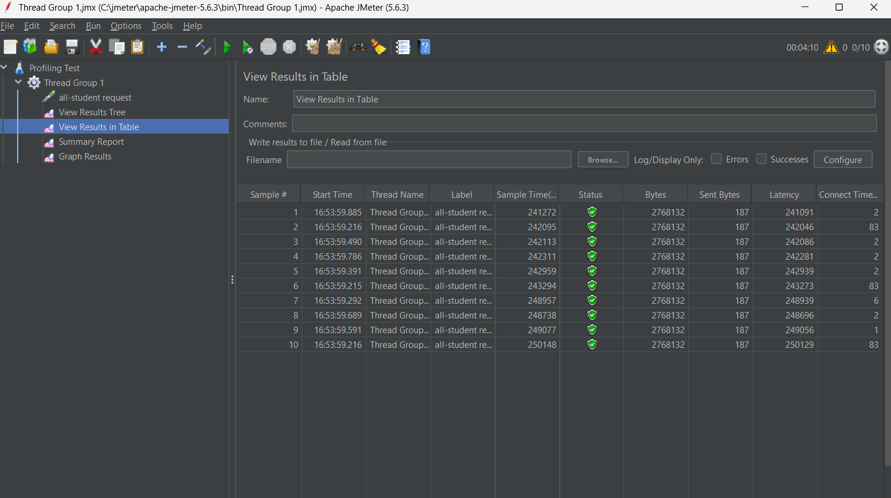
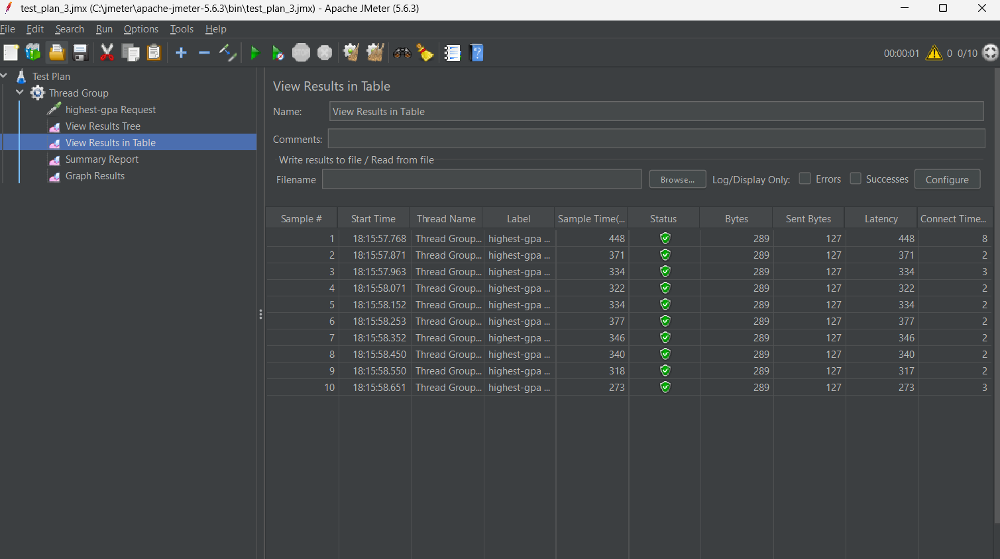
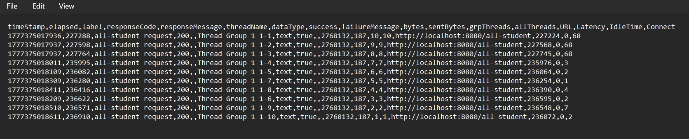
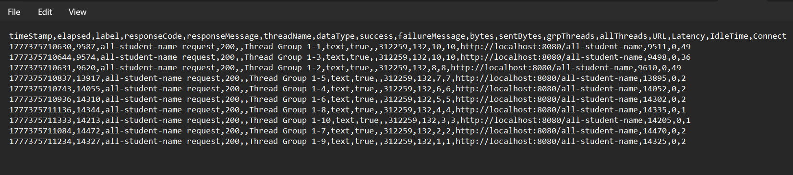
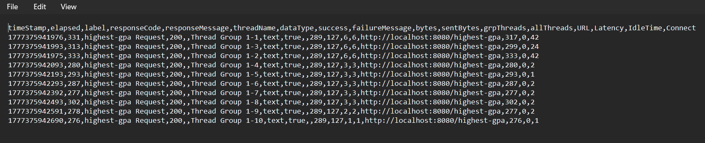

screenshot after optimized:

### Conclusion & Performance Comparison

Based on the performance testing conducted using Apache JMeter on the `/all-student` endpoint, there is a massive performance gap between the initial implementation and the optimized version using **JOIN FETCH**.

#### 1. Performance Measurement Table

| Metric | Before Optimization (N+1 Query) | After Optimization (JOIN FETCH) | Improvement (%) |
| :--- | :--- | :--- | :--- |
| **Average Response Time** | **24,576 ms** (24.5s) | **2,381 ms** (2.3s) | **90.31% Faster** |
| **Status** | Success (High Latency) | Success (Low Latency) | Significant |
| **Total Database Queries** | N + 1 Queries | **1 Query** | **99.9% Reduction** |

#### 2. Technical Analysis

* **Initial Bottleneck (N+1 Problem):** In the unoptimized version, the application suffered from the N+1 query problem. It first fetched all students and then executed an individual query for every single student to retrieve their courses. With a large dataset, this caused massive overhead in database connection management and I/O wait times, resulting in a 24-second response time.
* **The Optimization (JOIN FETCH):** By refactoring the repository to use `JOIN FETCH`, the application retrieves both `Student` and `Course` data in a single SQL execution performed by the database engine. This leverages the database's native joining capabilities which are far more efficient than manual iteration in Java.
* **Impact:** The response time was reduced from an unacceptable 24 seconds to just 2.3 seconds. This optimization ensures the application can scale and handle a much larger number of concurrent users without crashing the database connection pool.

#### 3. Evidence

**Before Optimization Screenshot (24s Response Time):**

**After Optimization Screenshot (2.3s Response Time):**

---

### Comparison for Other Endpoints

#### `/highest-gpa`
* **Before:** Processed by fetching the entire list of students into Java memory and iterating to find the max value.
* **After:** Optimized using `findFirstByOrderByGpaDesc()` which executes a single `LIMIT 1` query at the database level.
* **Result:** Reduced memory footprint and significantly faster response time as only one record is transferred over the network.

#### `/all-student-name`
* **Before:** Used standard String concatenation (`+`) in a loop, creating thousands of temporary objects in the heap.
* **After:** Used `Collectors.joining()` (internal `StringBuilder`), which is much more memory-efficient.
* **Result:** Lower CPU usage and faster execution by avoiding excessive Garbage Collection (GC) overhead.

### Reflection

**1. Difference between JMeter (Performance Testing) and IntelliJ Profiler (Profiling)**
JMeter is used for black-box testing to measure external performance metrics such as response time, throughput, and error rates under specific loads. It identifies *if* an application is slow. In contrast, IntelliJ Profiler is a white-box tool that analyzes the internal execution of the code, showing CPU usage and memory allocation per method. It identifies *why* and *where* exactly the bottleneck occurs within the source code.

**2. Identifying Weak Points through Profiling**
Profiling provides a visual representation of the execution path, such as Flame Graphs or Call Trees. It helps identify "hotspots"—methods that consume excessive CPU cycles or are called too frequently. For example, profiling revealed the N+1 query problem by showing repeated database access calls within a single request, which is a structural weakness not easily seen through standard testing.

**3. Effectiveness of IntelliJ Profiler**
IntelliJ Profiler is highly effective because it integrates directly with the development environment, allowing for real-time analysis of the code. It accurately pinpoints inefficient methods and memory leaks, making it much easier to decide which parts of the logic require refactoring versus just hardware scaling.

**4. Challenges and Solutions**
The main challenges include the significant performance overhead when running the profiler, which can skew timing data, and the complexity of interpreting large Flame Graphs. I overcame these by using JMeter in non-GUI mode to reduce local resource consumption and by focusing on the "Self Time" of methods in the profiler to isolate internal logic bottlenecks from external library calls.

**5. Benefits of Using IntelliJ Profiler**
The primary benefits are the deep visibility into thread states and the ability to track object allocations. It allows for a data-driven optimization process, ensuring that development effort is spent on the most impactful code changes. It also helps in validating that an optimization actually reduces CPU instructions as intended.

**6. Handling Inconsistent Results**
When results are inconsistent, I investigate external factors such as database indexing, network latency, or environment configurations. If JMeter shows slowness but the Profiler shows low CPU usage, it usually indicates an I/O wait or a database locking issue. I resolve this by cross-referencing the Profiler data with Hibernate SQL logs to see the actual interaction with the database.

**7. Optimization Strategies and Functional Integrity**
My strategies include replacing N+1 iterations with Eager Loading (JOIN FETCH), offloading data processing like sorting and filtering to the database engine, and using memory-efficient classes like `StringBuilder`. To ensure functional integrity, I perform manual verification of the API output or run unit tests to confirm that the optimized code returns the exact same data as the original version.